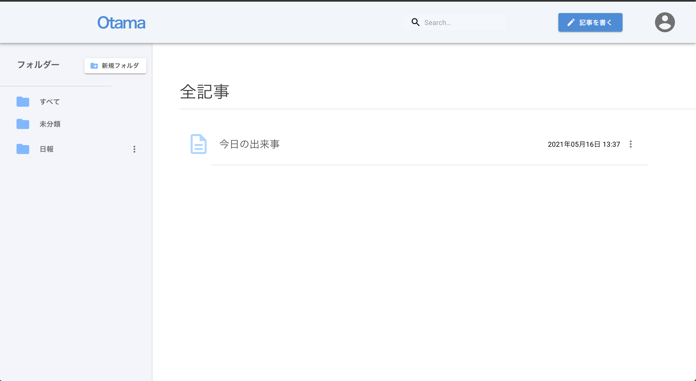
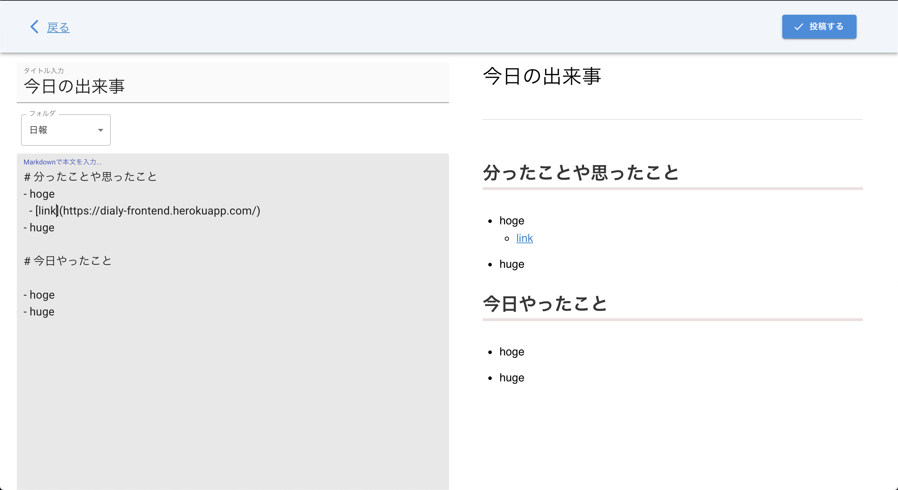

# React-Django DairyApp
React.js と Django REST FrameWork を用いてKibela風の日報アプリを作成.

Herokuデモ : https://dialy-frontend.herokuapp.com/

 

### 環境
- npm 7.3.0
- React 17.0.2
- Python 3.7
- Django 3.2.2
- djangorestframework 3.12.4

### 機能
- JSON Web Token(JWT)によるユーザ認証
- フォルダの追加・削除・編集
- 記事の追加・削除・編集
- エディタは MarkDown + リアルタイムプレビュー

 

### プレビュー

 

__ホーム画面__

 

__投稿画面__

